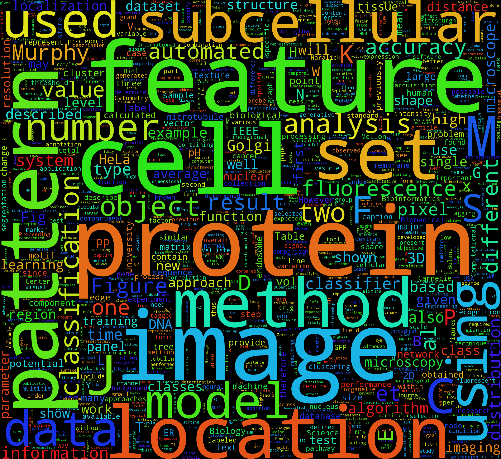
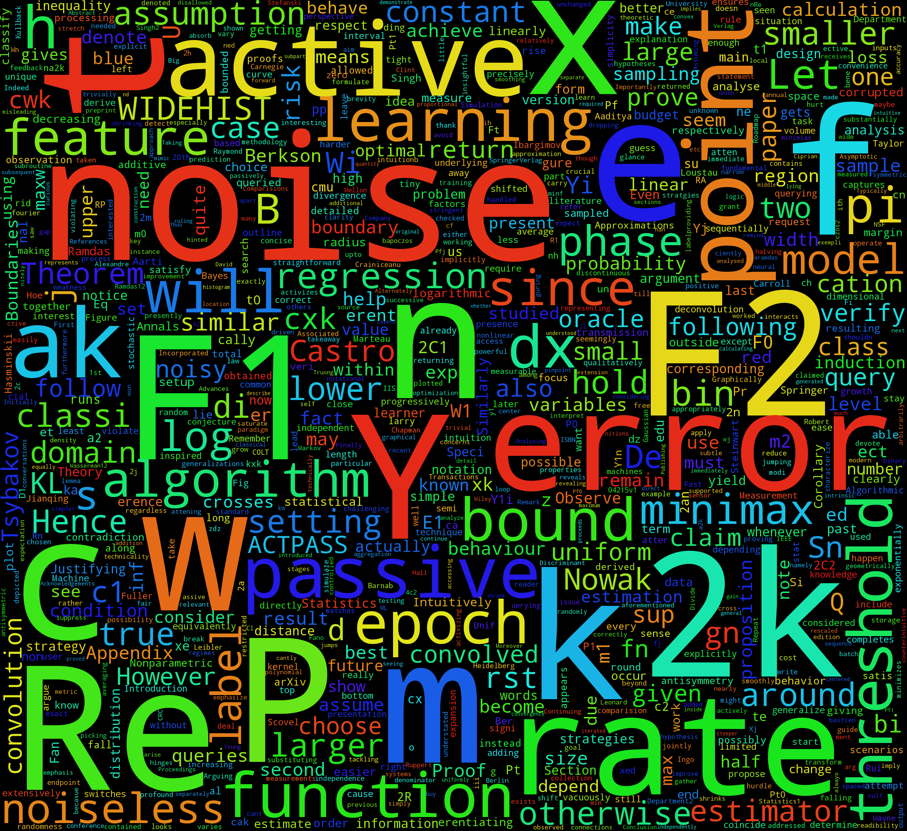

# scholarcloud
Simple script that generates a wordcloud from different scholarly resources.

This code is super-alpha. I am still testing other python packages that can I
piece together so that I do not have reinvent the wheel. If everything works as planed, scholarcloud will be nothing but
wrapper around existing tools.

## List of Examples
### example001
This example scrapes all the pages in Google Scholar that are related to Robert F.
Murphy. Since there is no official Google Scholar API, this is rather hacky. But it does the job.


### example002
This example downloads PDF files hosted in the Murphy Lab website (```found in links.out```)
and extracts the text to generate the wordclouds. This is rather hacky as well. But it does the job.



### example003
This example attempts to scrape the Google Scholar page associated with Carnegie Mellon University to extract the list of scientists registered in the site along with the Google Scholar ID.

### example004
This example attempts to extract the text from a PDF file within Python. At this point I am not happy with the results.


