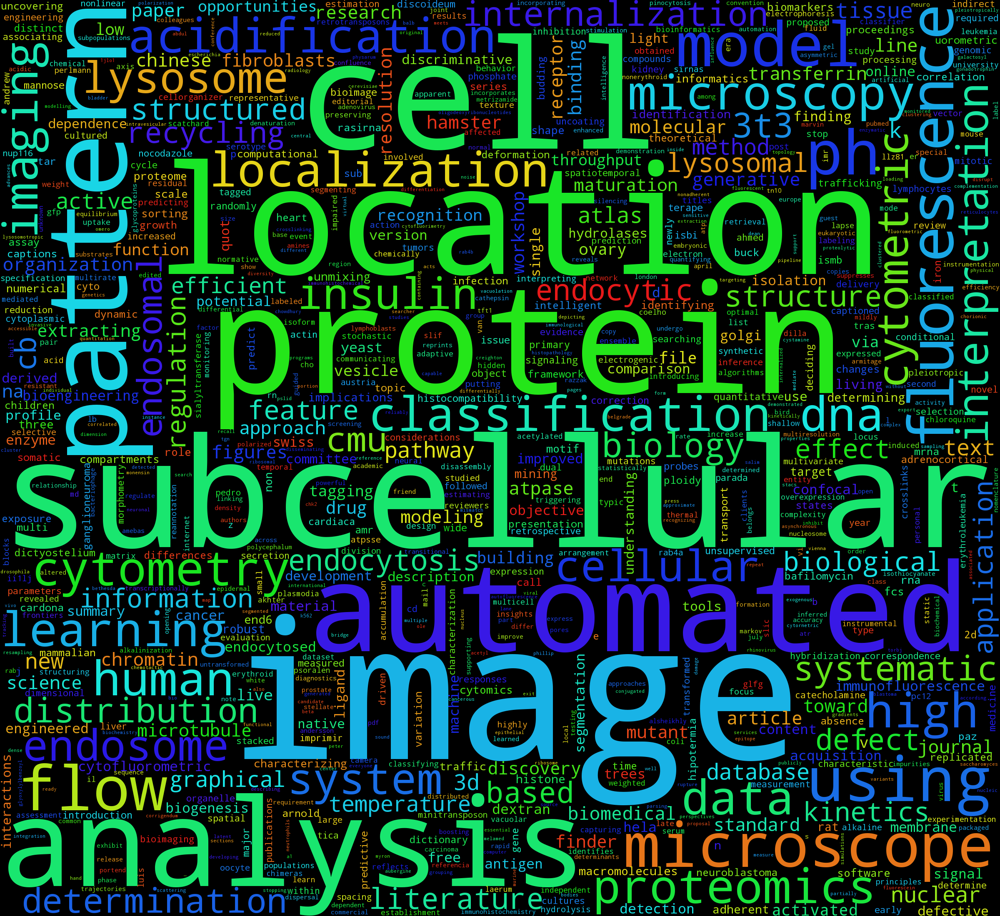

# scholarcloud
Simple script that generates a wordcloud from different scholar resources.

This code is super-alpha. I am still testing other python so that I do not have
reinvent the wheel. If everything works as planed, scholarcloud will be nothing but
wrapper around existing tools.

## List of Examples
### example001
This example scrapes all the pages in Google Scholar that are related to Robert F.
Murphy. Since there is no official Google Scholar API, this is rather hacky. But it does the job.

